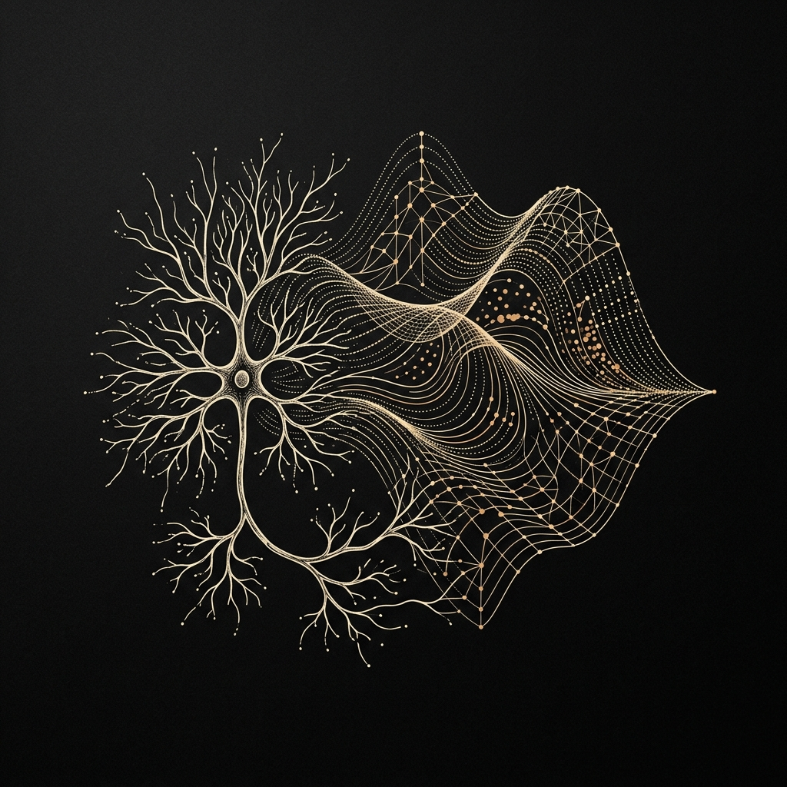
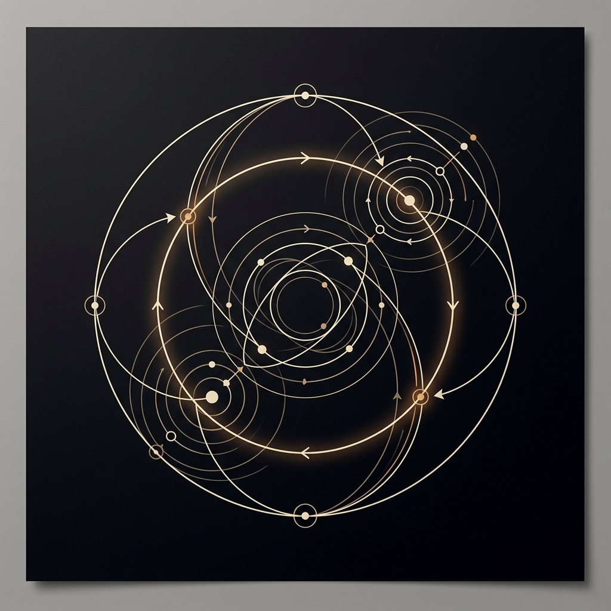

# ARNAV SHARMA

### *Systems Thinking · Theoretical Neuroscience · Synthetic Intelligence*

  <strong>University of California, Irvine</strong> 
  <code>[ FOCUS: THEORETICAL BIOLOGY &amp; EMBODIED CYBERNETICS ]</code> &nbsp;·&nbsp;
  <code>[ PARADIGM: CONTINUOUS HOMEOSTATIC EQUILIBRIUM ]</code>

---

### `// THE CENTRAL QUESTION`

> *"A twenty-watt organ of soft tissue navigates an unpredictable universe, integrates multi-sensory streams in real time, formulates internal causal models, and continuously reorganizes its own architecture—all while consuming less power than a dim lightbulb.*
> 
> *Meanwhile, our most advanced computing clusters consume megawatts to approximate associative patterns on static datasets.*
>
> *Why is living intelligence so robust, energy-efficient, and self-repairing, while synthetic systems remain brittle and fragile? The answer does not lie in raw compute. It lies in **systems architecture, non-equilibrium thermodynamics, and circular feedback**."*

I am an undergraduate systems researcher and software engineer at the University of California, Irvine. My work explores the fertile ground where **computational neuroscience, dynamical systems, and biological cybernetics** converge. I am driven by a singular curiosity: how nature constructs robust, autonomous minds out of noisy, wet, and dissipative matter—and how those biological principles can reshape synthetic intelligence.

---

### `// I. THE TRIAD OF LIVING COMPUTATION`

My research and engineering intuition rests on three foundational pillars:

<table width="100%" border="0">
  <tr>
    <td width="33.33%" align="center" valign="top" style="background:#090b10; border:1px solid #21262d; padding:14px;">
        
      <strong style="color:#f0efea; font-size:12px;">I. NEURAL DYNAMICS</strong> 
      THE BIOLOGICAL SUBSTRATE
      

        Living wetware is not a static feedforward matrix. It is a multi-scale, continuous dynamical manifold where ion channel kinetics, synaptic plasticity, and population rhythms coordinate in real time.
      

    </td>
    <td width="33.33%" align="center" valign="top" style="background:#090b10; border:1px solid #21262d; padding:14px;">
        
      <strong style="color:#f0efea; font-size:12px;">II. CYBERNETIC LOOPS</strong> 
      CIRCULAR CAUSALITY
      

        Linear causality is an engineering artifact. Organisms survive by closing the loop: action alters sensation, sensation updates internal beliefs, and beliefs guide the next homeostatic intervention.
      

    </td>
    <td width="33.33%" align="center" valign="top" style="background:#090b10; border:1px solid #21262d; padding:14px;">
        
      <strong style="color:#f0efea; font-size:12px;">III. STRANGE LOOPS</strong> 
      EMERGENT INTELLIGENCE
      

        How does self-awareness emerge from inanimate matter? Through recursive self-reference—strange loops where simple deterministic rules generate self-sustaining, adaptive cognitive models.
      

    </td>
  </tr>
</table>

---

### `// II. SYSTEMS THINKING: THE CLOSED-LOOP ARCHITECTURE`

In classical machine learning, computation is treated as a linear pipeline: $\text{Dataset} \to \text{Training} \to \text{Inference}$. 

In **cybernetics and embodied cognition**, linear causality does not exist. Biological intelligence is inherently circular. An organism continuously acts on its environment to minimize thermodynamic surprise, resisting entropy through closed-loop feedback:

  

#### Multi-Scale Biological Coordination
Biological intelligence does not operate at a single level of abstraction. It coordinates across nine orders of magnitude simultaneously:
- **Molecular ($10^{-9}\text{ m}$)**: Stochastic ion channel gating, receptor binding kinetics, and neurotransmitter diffusion.
- **Cellular ($10^{-6}\text{ m}$)**: Non-linear membrane conductances, dendritic integration, and action potential propagation.
- **Population ($10^{-2}\text{ m}$)**: Cortical dipole assemblies, phase synchronization, and macroscopic electrophysiological fields.
- **Whole Organism ($10^{0}\text{ m}$)**: Homeostatic regulation, sensorimotor coordination, and autonomous agency.

Understanding and synthesizing intelligence requires models that honor this continuous vertical hierarchy rather than collapsing it into isolated abstractions.

---

### `// III. ENGINEERING SUBSTRATES`

To translate theoretical neuroscience into verifiable, high-performance software, I adhere to low-level systems engineering principles:

<table width="100%">
  <tr>
    <td width="33%" valign="top" style="background:#090b10; border:1px solid #21262d; padding:16px;">
      <strong style="color:#58a6ff;">LOW-LEVEL SYSTEMS</strong>  
      <code>• Rust</code> <em>(deterministic concurrency &amp; safety)</em> 
      <code>• C / C++</code> <em>(high-throughput native FFI)</em> 
      <code>• Python 3.12+</code> <em>(scientific modeling)</em> 
      <code>• TypeScript</code> <em>(strictly typed ASTs &amp; tooling)</em>
    </td>
    <td width="33%" valign="top" style="background:#090b10; border:1px solid #21262d; padding:16px;">
      <strong style="color:#d29922;">BIOSIGNALS &amp; NUMERICS</strong>  
      <code>• MNE-Python</code> <em>(electrophysiology &amp; PSD)</em> 
      <code>• SciPy / NumPy</code> <em>(matrix decompositions)</em> 
      <code>• PyTorch</code> <em>(tensor manifolds &amp; dynamics)</em> 
      <code>• WebGL / Shaders</code> <em>(spatial field rendering)</em>
    </td>
    <td width="33%" valign="top" style="background:#090b10; border:1px solid #21262d; padding:16px;">
      <strong style="color:#3fb950;">SYSTEMS ARCHITECTURE</strong>  
      <code>• Zero-cost abstractions</code> 
      <code>• Lock-free ring buffers</code> 
      <code>• Memory-mapped binary ingestion</code> 
      <code>• Reproducible computational provenance</code>
    </td>
  </tr>
</table>

---

  <code>[ CONTACT // aaarnavsssharma@gmail.com ]</code> &nbsp;·&nbsp;
  <code>[ GITHUB // @A12N4V ]</code> &nbsp;·&nbsp;
  <code>[ IRVINE, CALIFORNIA ]</code>

<em>"We are not stuff that abides, but patterns that perpetuate themselves."</em> — Norbert Wiener, Cybernetics (1948)

