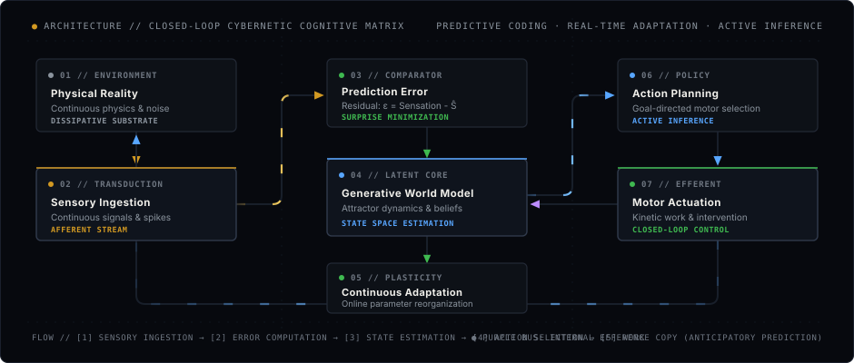

---

## The Question That Drives My Work

> *"A twenty-watt organ of soft tissue navigates an unpredictable world, integrates multi-sensory streams in real time, builds internal causal models, and continuously reorganizes its own architecture—all while consuming less power than a dim household lightbulb.*
> 
> *Meanwhile, our most advanced computing clusters consume megawatts to approximate statistical patterns on static datasets.*
>
> *Why is living intelligence so robust, adaptable, and self-repairing, while artificial systems remain brittle and fragile? The answer isn't raw compute. It's **systems architecture, non-equilibrium thermodynamics, and circular feedback**."*

Hey, I'm **Arnav**. I'm an undergraduate software engineer and student researcher at the **University of California, Irvine**.

My curiosity lives at the intersection of **systems thinking, computational neuroscience, and artificial intelligence**. Rather than treating machine learning as purely a curve-fitting problem or biology as an isolated collection of anatomy, I study how living brains actually solve the problem of autonomy—and how those architectural principles can help us build more resilient, adaptive software.

---

## What I'm Exploring

### 1. Biological Computation vs. Synthetic Pipelines
Today's artificial neural networks are largely feedforward pipelines: they take a batch of data, compute matrix multiplications, and calculate a loss. But biological wetware operates continuously. Neurons don't wait for "batches"—they process asynchronous spike trains, adapt local synaptic weights in real time without catastrophic forgetting, and run in continuous time. I explore how ideas from neuromorphic computing and dynamical systems can bridge this gap.

### 2. Closed-Loop Systems & Circular Causality
In classical software, computation is linear: $\text{Input} \to \text{Transform} \to \text{Output}$. In living organisms, linear causality doesn't exist. Every action an organism takes changes the physical environment, which immediately alters sensory feedback, which updates internal beliefs, which dictates the next action. Living intelligence is an unbroken, self-regulating feedback loop.

### 3. Strange Loops & Emergent Intelligence
How does agency and self-awareness emerge from physical matter? Through recursive self-reference—what Douglas Hofstadter termed *strange loops*. When simple deterministic micro-rules interact within a closed feedback hierarchy, emergent macroscopic behaviors arise that cannot be explained by looking at individual parts in isolation.

---

## Systems Architecture: The Closed-Loop Mind

To visualize how living intelligence coordinates perception, prediction, and action, I model the brain as a continuous, closed-loop cybernetic system:

  

### How the Flow Works:
1. **Sensory Ingestion (Afferent Stream)**: Physical stimuli from the environment are continuously transduced by sensory receptors into spatiotemporal spike events.
2. **Prediction Error Computation**: The brain doesn't just passively receive inputs; it continuously predicts what it should sense. The **Predictive Comparator** subtracts top-down predictions from bottom-up sensations to calculate the error residual ($\varepsilon$).
3. **Generative World Model**: The central core updates its latent state estimates based on prediction errors, maintaining an internal model of the external world.
4. **Efference Copy (Internal Anticipation)**: When motor actions are planned, an internal copy (*efference copy*, shown in purple) is sent back to the world model before execution, allowing the system to anticipate the sensory consequences of its own movement.
5. **Homeostatic Actuation & Work**: Motor commands intervene in the physical world, completing the causal circle.

---

## Technical Stack & Substrates

When translating theoretical concepts into software, I prioritize low-level performance, memory safety, and reproducible architectures:

<table width="100%">
  <tr>
    <td width="33%" valign="top">
      <strong>SYSTEMS &amp; LANGUAGES</strong>  
      <code>• Rust</code> <em>(memory safety &amp; concurrency)</em> 
      <code>• C / C++</code> <em>(native performance &amp; FFI)</em> 
      <code>• Python 3.12+</code> <em>(scientific modeling)</em> 
      <code>• TypeScript</code> <em>(tooling &amp; interfaces)</em>
    </td>
    <td width="33%" valign="top">
      <strong>SCIENTIFIC COMPUTING</strong>  
      <code>• PyTorch</code> <em>(tensor dynamics &amp; neural models)</em> 
      <code>• NumPy / SciPy</code> <em>(linear algebra &amp; numerics)</em> 
      <code>• MNE-Python</code> <em>(electrophysiology &amp; signals)</em> 
      <code>• Three.js / WebGL</code> <em>(visual telemetry)</em>
    </td>
    <td width="33%" valign="top">
      <strong>ARCHITECTURAL PRINCIPLES</strong>  
      <code>• Zero-cost abstractions</code> 
      <code>• Lock-free ring buffers</code> 
      <code>• Event-driven asynchronous pipelines</code> 
      <code>• Deterministic computational provenance</code>
    </td>
  </tr>
</table>

---

  <code>[ GITHUB // @A12N4V ]</code> &nbsp;·&nbsp;
  <code>[ EMAIL // aaarnavsssharma@gmail.com ]</code> &nbsp;·&nbsp;
  <code>[ UNIVERSITY OF CALIFORNIA, IRVINE ]</code>

<em>"We are not stuff that abides, but patterns that perpetuate themselves."</em> — Norbert Wiener

