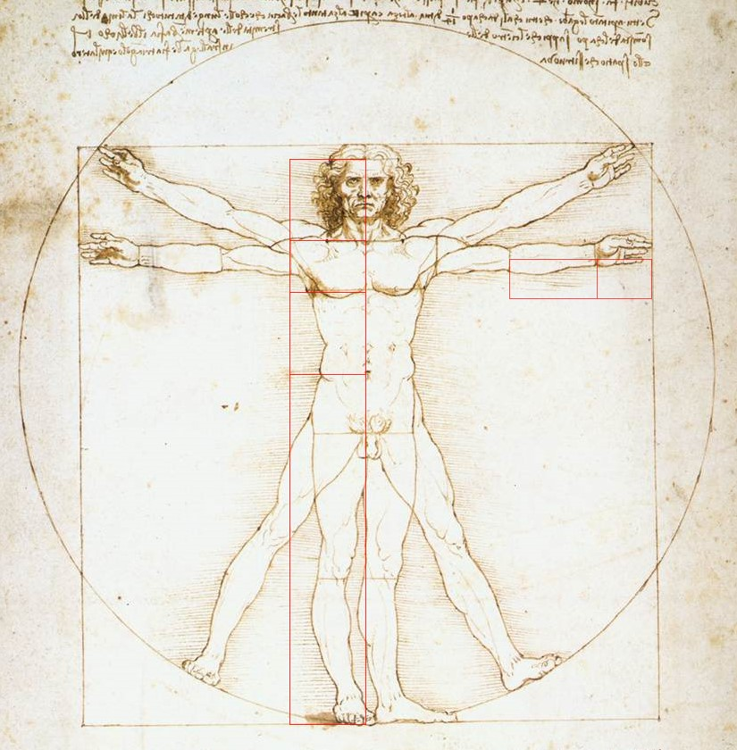
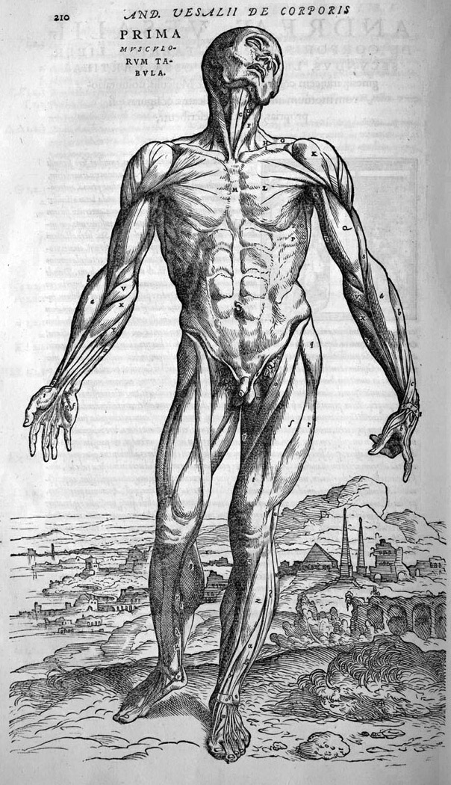
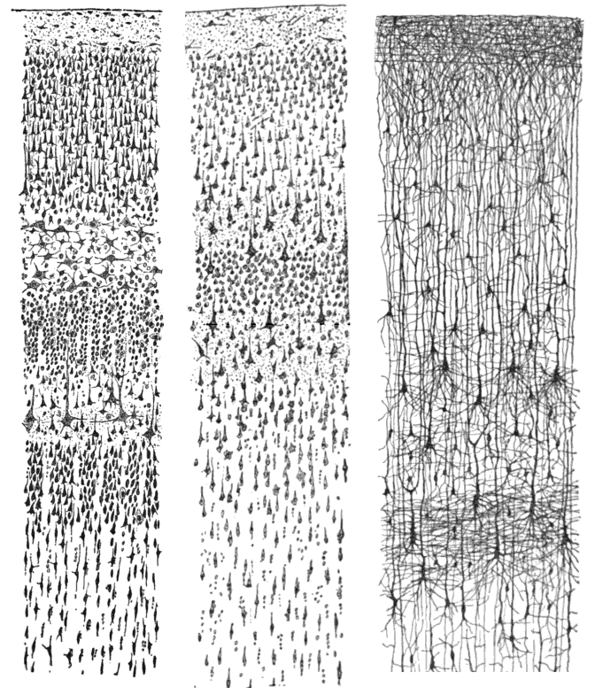
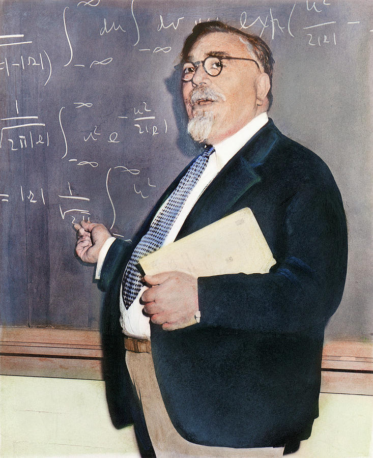
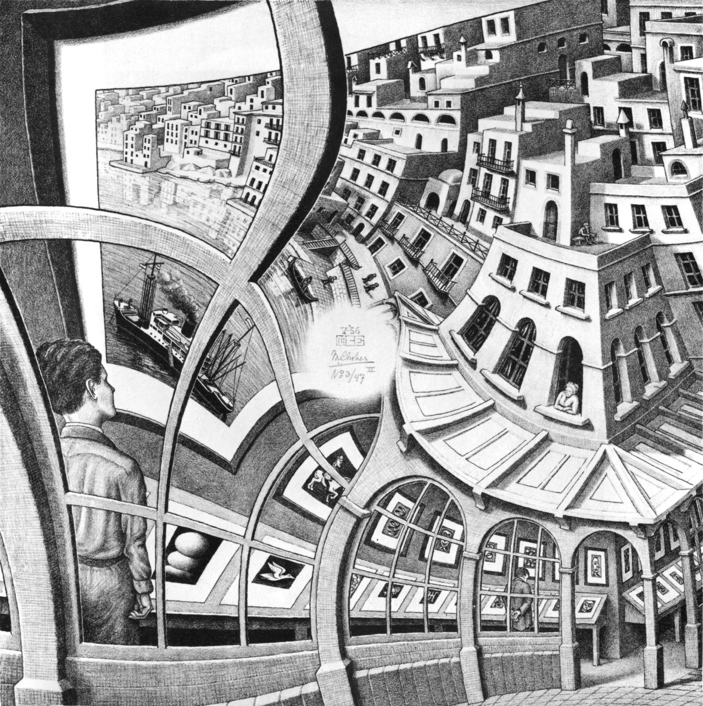
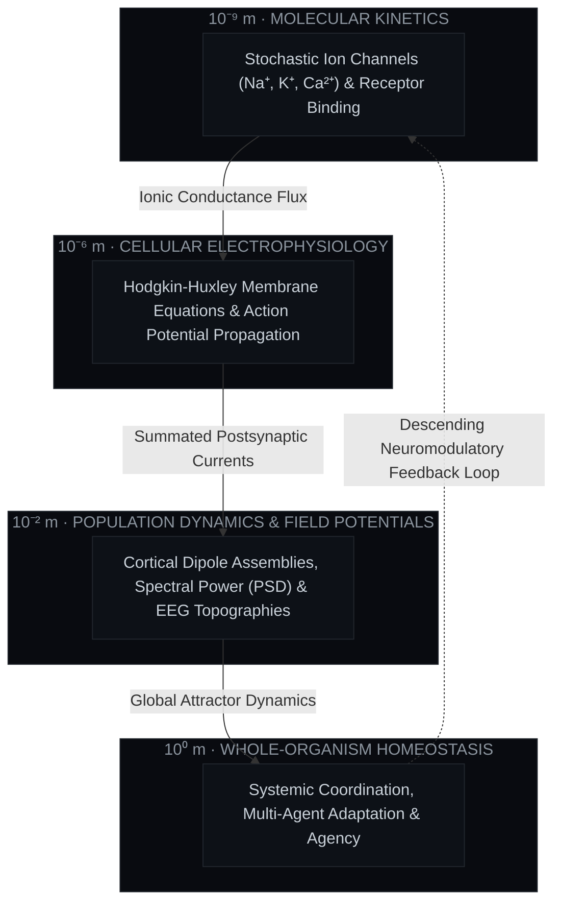

<div align="center">

# ARNAV SHARMA

### *The Animal and the Machine: Explorations at the Confluence of Systems Thinking, Theoretical Neuroscience, and Synthetic Intelligence*

<p align="center">
  <strong>University of California, Irvine</strong><br>
  <code>[ COORD: 33.6405° N, 117.8443° W ]</code> &nbsp;·&nbsp;
  <code>[ ATTESTATION: VERIFIED ]</code> &nbsp;·&nbsp;
  <code>[ PARADIGM: DYNAMICAL EQUILIBRIUM ]</code>
</p>

</div>

---

### `// PROLOGUE · THE CENTRAL QUESTION`

> *"A twenty-watt organ of soft tissue navigates an unpredictable universe, integrates multi-sensory streams in real time, formulates internal causal models, and continuously reorganizes its own architecture—all while consuming less power than a dim lightbulb.*
> 
> *Meanwhile, our most advanced computing clusters consume megawatts to approximate associative patterns on static datasets.*
>
> *Why is living intelligence so robust, energy-efficient, and self-repairing, while synthetic systems remain brittle and fragile? The answer does not lie in raw compute. It lies in **systems architecture, non-equilibrium thermodynamics, and circular feedback**."*

I am an undergraduate systems researcher and software engineer at the University of California, Irvine. My work exists at the intersection of **computational neuroscience, dynamical systems, and biological cybernetics**. I build deterministic computational platforms that treat the human organism not as an assortment of disconnected parts, but as a continuous, multiscale feedback machine—formalizing biophysical realities from ion channels to cortical manifolds.

---

### `// I. THE INTELLECTUAL LINEAGE`

No idea begins in a vacuum. My approach to systems engineering is directly anchored in five centuries of thinkers who refused to separate anatomy from physics, or communication from biology:

<table width="100%" border="0">
  <tr>
    <td width="20%" align="center" valign="top" style="background:#090b10; border:1px solid #21262d; padding:12px;">
      <br><br>
      <strong style="color:#f0efea; font-size:11px;">I. BIOMECHANICS &amp; FORM</strong><br>
      <sub style="color:#8b949e; font-size:10px;">LEONARDO DA VINCI (1490)</sub>
      <p style="color:#8b949e; font-size:11px; line-height:1.4; text-align:left; margin-top:8px;">
        Unified geometry with biological locomotion, establishing organisms as thermodynamic, physical architectures governed by natural law.
      </p>
    </td>
    <td width="20%" align="center" valign="top" style="background:#090b10; border:1px solid #21262d; padding:12px;">
      <br><br>
      <strong style="color:#f0efea; font-size:11px;">II. ANATOMICAL BLUEPRINT</strong><br>
      <sub style="color:#8b949e; font-size:10px;">ANDREAS VESALIUS (1543)</sub>
      <p style="color:#8b949e; font-size:11px; line-height:1.4; text-align:left; margin-top:8px;">
        <em>De Humani Corporis Fabrica</em> dismantled 1,300 years of scholastic dogma, replacing hearsay with verifiable dissection of living mechanical form.
      </p>
    </td>
    <td width="20%" align="center" valign="top" style="background:#090b10; border:1px solid #21262d; padding:12px;">
      <br><br>
      <strong style="color:#f0efea; font-size:11px;">III. THE NEURON DOCTRINE</strong><br>
      <sub style="color:#8b949e; font-size:10px;">SANTIAGO RAMÓN Y CAJAL (1899)</sub>
      <p style="color:#8b949e; font-size:11px; line-height:1.4; text-align:left; margin-top:8px;">
        Revealed the "butterflies of the soul," proving that the nervous system is not a continuous reticulum, but a discrete network of polarized communicating units.
      </p>
    </td>
    <td width="20%" align="center" valign="top" style="background:#090b10; border:1px solid #21262d; padding:12px;">
      <br><br>
      <strong style="color:#f0efea; font-size:11px;">IV. CYBERNETICS &amp; CONTROL</strong><br>
      <sub style="color:#8b949e; font-size:10px;">NORBERT WIENER (1948)</sub>
      <p style="color:#8b949e; font-size:11px; line-height:1.4; text-align:left; margin-top:8px;">
        Unified the animal and the machine through circular causal chains, negative feedback loops, and entropy reduction in complex systems.
      </p>
    </td>
    <td width="20%" align="center" valign="top" style="background:#090b10; border:1px solid #21262d; padding:12px;">
      <br><br>
      <strong style="color:#f0efea; font-size:11px;">V. STRANGE LOOPS</strong><br>
      <sub style="color:#8b949e; font-size:10px;">M.C. ESCHER (1948)</sub>
      <p style="color:#8b949e; font-size:11px; line-height:1.4; text-align:left; margin-top:8px;">
        <em>Drawing Hands</em> captured the essence of self-reference: how deterministic micro-rules yield emergent, self-sustaining cognitive loops.
      </p>
    </td>
  </tr>
</table>

---

### `// II. SYSTEMS THINKING: THE CLOSED-LOOP CAUSAL MATRIX`

In classical software engineering, computation is conceptualized linearly: $\text{Input} \to \text{Transform} \to \text{Output}$.

In **cybernetics and theoretical neuroscience**, linear causality is an illusion. Biological systems are closed causal loops: an action alters the environment, which feeds back to alter sensations, which updates internal beliefs, which dictates the next action:

```mermaid
flowchart LR
    subgraph World ["ENVIRONMENT & DISSIPATIVE SUBSTRATE"]
        E["Physical Reality, Perturbations & Thermodynamic Work"]
    end

    subgraph Afferent ["AFFERENT TRANSDUCTION"]
        S["Sensory Surfaces · Ion Gating · Electrophysiology"]
    end

    subgraph Manifold ["NEURAL & COGNITIVE MANIFOLD"]
        direction TB
        C["Generative World Model (State Estimation)"]
        Err["Prediction Error Computation (ε = y - ŷ)"]
        M["Latent State Trajectory & Attractor Dynamics (ẋ)"]
        C --> Err --> M
    end

    subgraph Efferent ["EFFERENT ACTUATION"]
        A["Homeostatic Control Policy & Motor Execution (u)"]
    end

    E -->|Physical Stimuli| S
    S -->|Transduced Sensory Stream| C
    M -->|Control Signal u(t)| A
    A -->|Intervention & Work| E

    classDef env fill:#161b22,stroke:#30363d,color:#8b949e;
    classDef afferent fill:#1a1c23,stroke:#d29922,color:#f0efea;
    classDef manifold fill:#0d1117,stroke:#58a6ff,color:#f0efea;
    classDef efferent fill:#121f17,stroke:#3fb950,color:#f0efea;

    class E env;
    class S afferent;
    class C,M,Err manifold;
    class A efferent;
```

#### The Multi-Scale Biological Hierarchy

Biological intelligence operates across nine orders of magnitude simultaneously. A failure to model any tier results in an incomplete simulation:



---

### `// III. MATHEMATICAL FORMALISMS`

A rigorous systems approach replaces hand-waving metaphors with formal physical and mathematical equations:

#### 1. The Biophysical Substrate: Hodgkin-Huxley Membrane Kinetics (1952)
The fundamental differential equations describing action potential generation across excitable neuronal and myocardial membranes:

$$
C_m \frac{dV}{dt} = I_{\text{inj}} - \bar{g}_{\text{Na}} m^3 h (V - E_{\text{Na}}) - \bar{g}_{\text{K}} n^4 (V - E_{\text{K}}) - g_L (V - E_L)
$$

$$
\frac{dm}{dt} = \alpha_m(V)(1 - m) - \beta_m(V)m, \quad \frac{dh}{dt} = \alpha_h(V)(1 - h) - \beta_h(V)h, \quad \frac{dn}{dt} = \alpha_n(V)(1 - n) - \beta_n(V)n
$$

#### 2. The Cybernetic State-Space Dynamic
Representing high-dimensional physiological and artificial cognitive states as continuous trajectories through a latent state space:

$$
\dot{\mathbf{x}}(t) = \mathbf{A}\mathbf{x}(t) + \mathbf{B}\mathbf{u}(t) + \mathbf{w}(t), \quad \mathbf{y}(t) = \mathbf{C}\mathbf{x}(t) + \mathbf{v}(t)
$$

Where $\mathbf{x}(t) \in \mathbb{R}^n$ represents the internal physiological/latent state vector, $\mathbf{u}(t)$ is the regulatory control input, and $\mathbf{w}(t), \mathbf{v}(t)$ denote Gaussian process disturbances and observation noise.

#### 3. The Variational Free Energy Principle (Friston, 2006)
How biological self-organizing systems minimize surprise and resist entropic dispersal through active inference:

$$
\mathcal{F} = \mathbb{E}_{q(\mathbf{s})}[\ln q(\mathbf{s}) - \ln p(\mathbf{s}, \mathbf{o})] = \underbrace{D_{\text{KL}}\big[q(\mathbf{s}) \parallel p(\mathbf{s} \mid \mathbf{o})\big]}_{\text{Divergence Bound} \ge 0} - \underbrace{\ln p(\mathbf{o})}_{\text{Sensory Evidence}}
$$

#### 4. Information Entropy & Channel Constraints (Shannon, 1948)
Quantifying the informational capacity of neural communication channels:

$$
H(X) = -\sum_{x \in \mathcal{X}} p(x) \log_2 p(x), \quad I(X; Y) = H(X) - H(X \mid Y)
$$

---

### `// IV. TECHNICAL SUBSTRATES & ENGINEERING METHODOLOGY`

To bridge theoretical formalisms with production reality, I adhere to strict low-level engineering principles:

<table width="100%">
  <tr>
    <td width="33%" valign="top" style="background:#090b10; border:1px solid #21262d; padding:16px;">
      <strong style="color:#00f0ff;">LOW-LEVEL SYSTEMS</strong><br><br>
      <code>• Rust</code> <em>(memory safety &amp; concurrency)</em><br>
      <code>• C / C++</code> <em>(high-throughput FFI)</em><br>
      <code>• Python 3.12+</code> <em>(scientific computing)</em><br>
      <code>• TypeScript</code> <em>(strictly typed ASTs)</em>
    </td>
    <td width="33%" valign="top" style="background:#090b10; border:1px solid #21262d; padding:16px;">
      <strong style="color:#d29922;">BIOSIGNALS &amp; NUMERICS</strong><br><br>
      <code>• MNE-Python</code> <em>(EEG/MEG processing)</em><br>
      <code>• SciPy / NumPy</code> <em>(matrix decompositions)</em><br>
      <code>• PyTorch</code> <em>(tensor manifolds)</em><br>
      <code>• Three.js / WebGL</code> <em>(3D shaders)</em>
    </td>
    <td width="33%" valign="top" style="background:#090b10; border:1px solid #21262d; padding:16px;">
      <strong style="color:#00ff9d;">SYSTEMS ARCHITECTURE</strong><br><br>
      <code>• Zero-cost abstractions</code><br>
      <code>• Lock-free ring buffers</code><br>
      <code>• Memory-mapped binary ingestion</code><br>
      <code>• Provenance reproducibility</code>
    </td>
  </tr>
</table>

---

<div align="center">

<p align="center">
  <code>[ CONTACT // aaarnavsssharma@gmail.com ]</code> &nbsp;·&nbsp;
  <code>[ GITHUB // @A12N4V ]</code> &nbsp;·&nbsp;
  <code>[ LOCATION // IRVINE, CALIFORNIA ]</code>
</p>

<sub><em>"We are not stuff that abides, but patterns that perpetuate themselves."</em> — Norbert Wiener</sub>

</div>
