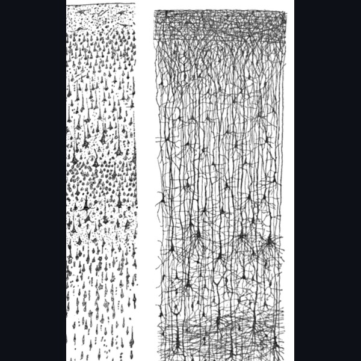
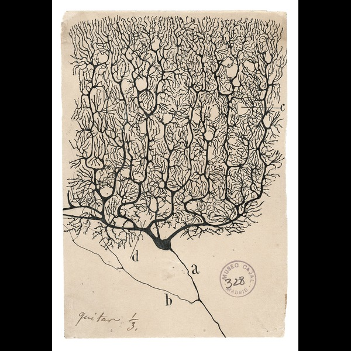
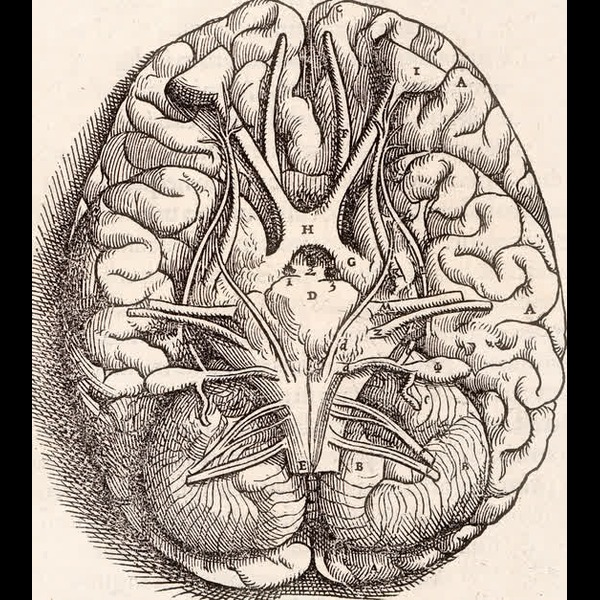

   
   
  

I am an undergraduate student and software engineer at the **University of California, Irvine**. 

I am deeply interested in **cybernetics, systems thinking, and artificial intelligence**, particularly the intersection where biological computation and synthetic systems meet. I explore how living organisms solve autonomy, continuous adaptation, and self-repair on mere watts of energy, and how to apply those principles to build better software and intelligent machines.

---

## Biological Architectures

<table width="100%" border="0" bgcolor="#000000" style="background-color: #000000; border-collapse: collapse;">
  <tr bgcolor="#000000">
    <td width="33.33%" align="center" valign="top" bgcolor="#000000" style="background-color: #000000; border: 1px solid #1a1a1a; padding: 14px;">
        
      <strong style="color: #ffffff; font-size: 12px;">SYNAPTIC CONNECTIVITY</strong> 
      NEURAL TRANSMISSION
      

        Local synaptic junctions and dendritic networks capable of asynchronous, continuous learning without catastrophic forgetting.
      

    </td>
    <td width="33.33%" align="center" valign="top" bgcolor="#000000" style="background-color: #000000; border: 1px solid #1a1a1a; padding: 14px;">
        
      <strong style="color: #ffffff; font-size: 12px;">PURKINJE CELL</strong> 
      SANTIAGO RAMÓN Y CAJAL
      

        The massive arborization of a cerebellar Purkinje neuron, integrating thousands of concurrent inputs into coordinated real-time action.
      

    </td>
    <td width="33.33%" align="center" valign="top" bgcolor="#000000" style="background-color: #000000; border: 1px solid #1a1a1a; padding: 14px;">
        
      <strong style="color: #ffffff; font-size: 12px;">CORTICAL ARCHITECTURE</strong> 
      WHOLE-ORGANISM INTEGRATION
      

        High-level cortical manifolds coordinating sensory feedback, internal generative world models, and homeostatic regulation.
      

    </td>
  </tr>
</table>

---

## Systems Thinking Basics

Systems thinking is the practice of understanding how things influence one another within an interconnected whole:

- **Think in Loops, Not Lines**: In classical logic, cause and effect are linear: $A \to B$. In living systems, causality is circular: $A \to B \to C \to A$. Your actions alter your environment, which changes what you sense next.
- **Look for the Delays**: The effect of an intervention rarely shows up immediately. When there is a lag between action and result, people often overcorrect, destabilizing the system.
- **Emergence Over Components**: You cannot understand an ant colony by dissecting an ant, and you cannot understand consciousness by isolating a neuron. The power lives in the feedback between the parts.
- **Balancing vs. Compounding**: Reinforcing loops amplify changes through exponential compounding; balancing loops push back toward equilibrium and homeostasis. Resilient systems require both.

---

## Problem Solving Basics

When approaching complex engineering and research challenges:

  

- **First Principles**: Boil problems down to their most fundamental truths and reason upwards. Reject assumptions borrowed from convention.
- **Inversion**: Instead of asking *"How do I guarantee success?"*, ask *"What would cause this to fail completely?"* Eliminate the failure modes first.
- **Find the Active Bottleneck**: In any system with multiple steps, only one constraint limits total throughput at any given time. Optimizing anything else is wasted effort.
- **Tighten the Feedback Loop**: Shorten the duration between writing code, testing a hypothesis, and observing reality. Velocity comes from iteration speed.

---

## On Theosis & Where Humanity Is Heading

> *"The future of humanity is not about escaping our biology or surrendering to silicon. It is about **theosis** in its most grounded and human sense: humanity slowly learning to steward its own evolutionary trajectory.*
> 
> *For millions of years, evolution was driven by blind physical pressure. Now, through language, science, and computing, consciousness has begun to understand and shape itself. The goal is not to build artificial minds that make humans obsolete, but to design systems that harmonize with living intelligence, expanding our capacity to understand, heal, and create."*
>
> *"We are as gods and might as well get good at it."* - Stewart Brand, Whole Earth Catalog (1968)

---

  <code>[ GITHUB // @A12N4V ]</code> &nbsp;·&nbsp;
  <code>[ EMAIL // aaarnavsssharma@gmail.com ]</code> &nbsp;·&nbsp;
  <code>[ UC IRVINE ]</code>

