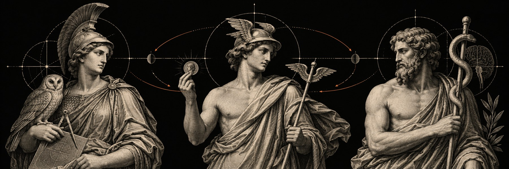
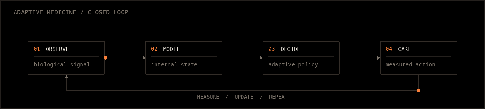
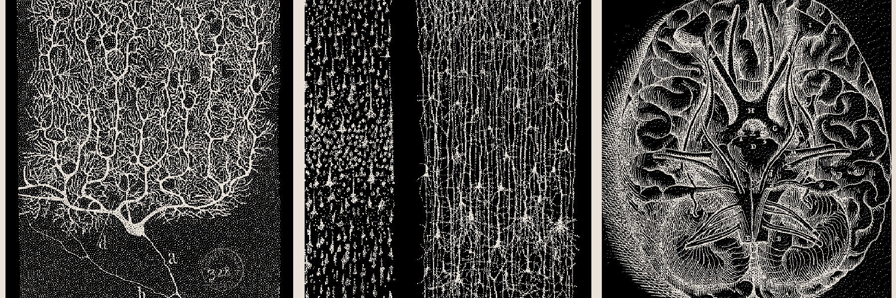

  
   
  ATHENA · HERMES · ASCLEPIUS &nbsp;/&nbsp; WISDOM · EXCHANGE · MEDICINE

# Arnav Sharma

Undergraduate at **UC Irvine** exploring neural systems, AI, and medical technology.

I’m interested in biologically grounded AI and software that helps us understand and improve human health.

**FOCUS** &nbsp; Neural systems · adaptive AI · medtech

## A direction of travel

  

## Neural atlas

  
  PURKINJE TREE &nbsp;·&nbsp; CORTICAL LAYERS &nbsp;·&nbsp; BRAIN ANATOMY

---

  <a href="https://a12n4v.github.io">SITE</a> &nbsp;·&nbsp; <a href="mailto:aaarnavsssharma@gmail.com">EMAIL</a> &nbsp;·&nbsp; UC IRVINE

