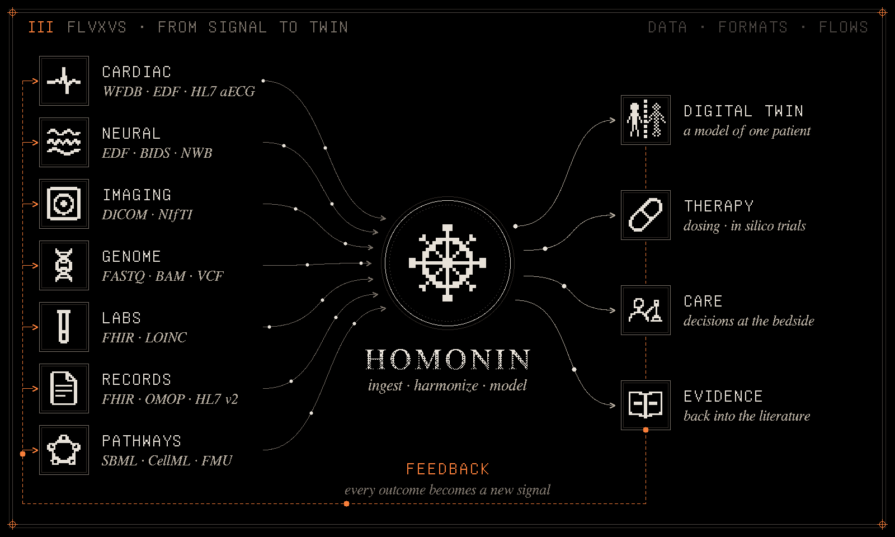

  

# Arnav Sharma

  
  
  
  

Undergraduate at **UC Irvine**, working where **medicine** meets **computation**: biodigital twins, medical AI, and the cybernetics that ties them together. I build **[Homonin](https://homonin.com)**, a cyber-medical research workspace.

A body produces **signals**. A model turns those signals into **signs**. A controller acts on the signs, and the body answers. I work on that loop.

**FOCUS** &nbsp; biodigital twins · medical AI · neural systems · cybernetics

 

  
  Beer's <i>Viable System Model</i> (<i>Brain of the Firm</i>, 1972), with Homonin at the center. Every system sends its signal in, Homonin integrates them, and feedback goes back out to each one.

  

  
  What the body emits, the formats it arrives in, and where it goes. The helm is the <i>kybernetes</i>, the steersman that gave cybernetics its name.

  

  
  Live. A GitHub Action re-renders this plate every day from this account's activity.

 

  

---

  <b>CORPVS · SIGNVM · MACHINA</b> &nbsp;·&nbsp; UC IRVINE

