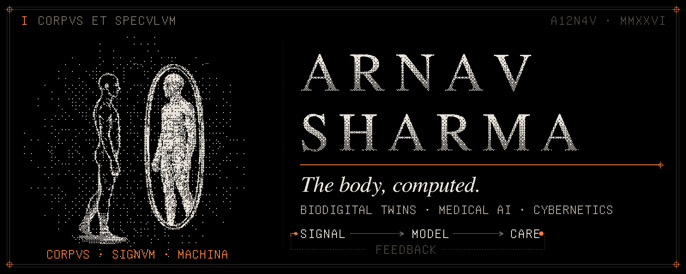
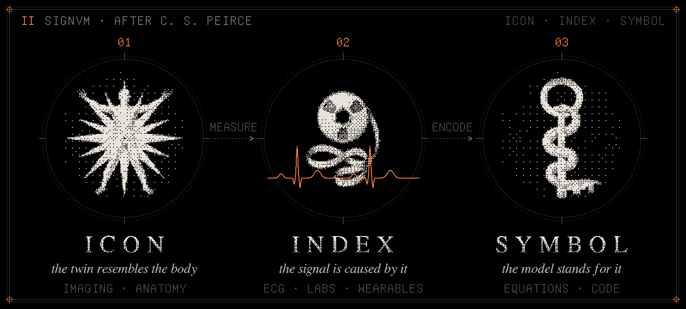
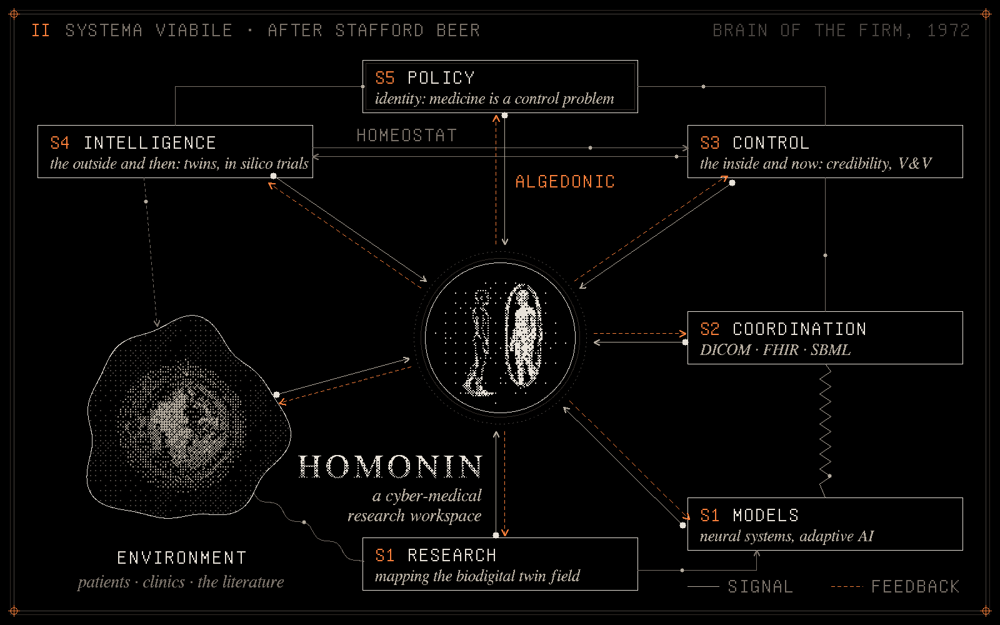
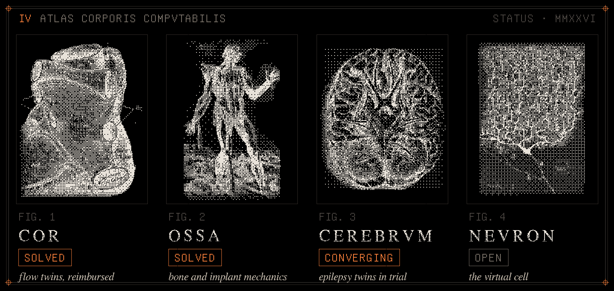
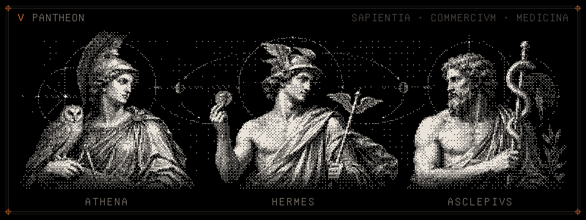

  

 

Undergraduate at **UC Irvine**, working where **medicine** meets **computation**: biodigital twins, medical AI, and the cybernetics that ties them together. I build **Homonin**, a cyber-medical research workspace.

A body produces **signals**. A model turns those signals into **signs**. A controller acts on the signs, and the body answers. I work on that loop.

**FOCUS** &nbsp; biodigital twins · medical AI · neural systems · cybernetics

 

  
  A twin is a sign of the body. It works first as an <b>icon</b>, then as an <b>index</b>, and finally as a <b>symbol</b>.

  

  
  How the work is organized, drawn as Beer's <i>Viable System Model</i> (<i>Brain of the Firm</i>, 1972). Medicine is treated as a control problem.

  

  
  Which organs can be computed, as of 2026. The heart and bone are solved, the brain is converging, and the cell is still open.

  

  

---

  <b>CORPVS · SIGNVM · MACHINA</b>
   
  <a href="https://a12n4v.github.io">SITE</a> &nbsp;·&nbsp; <a href="mailto:aaarnavsssharma@gmail.com">EMAIL</a> &nbsp;·&nbsp; UC IRVINE

